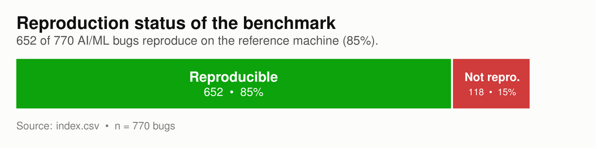
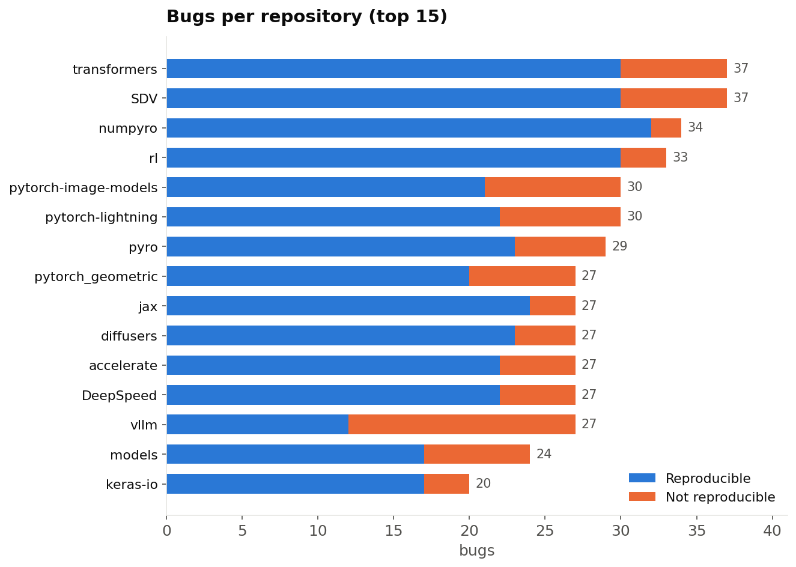
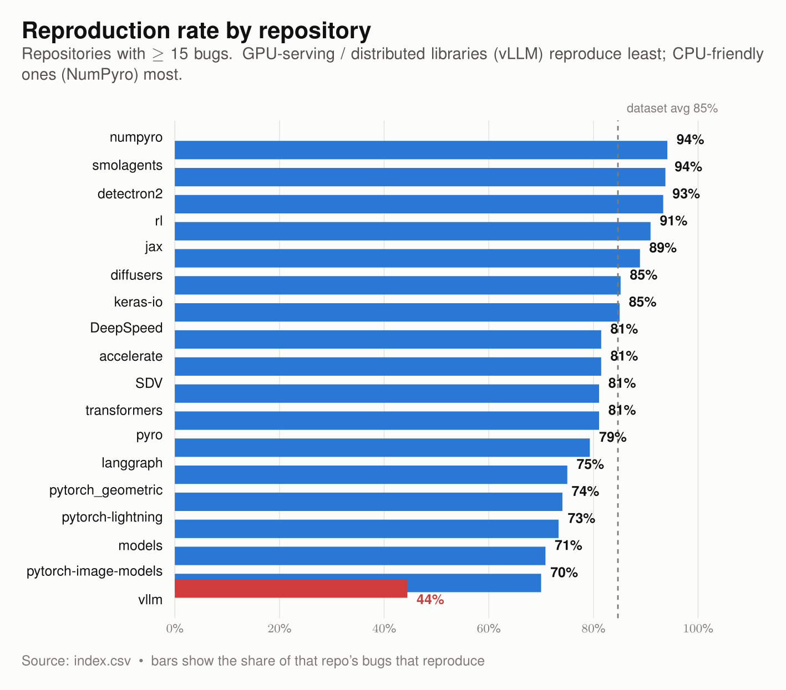
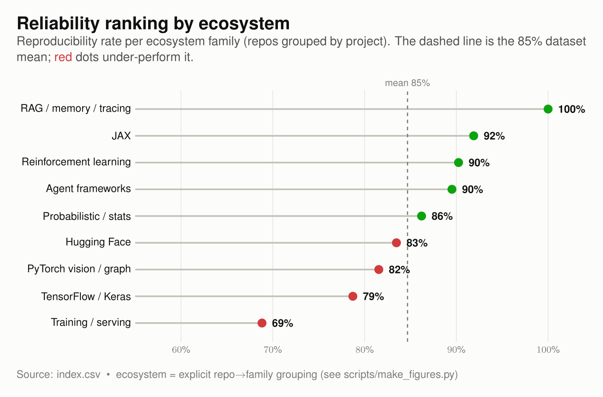
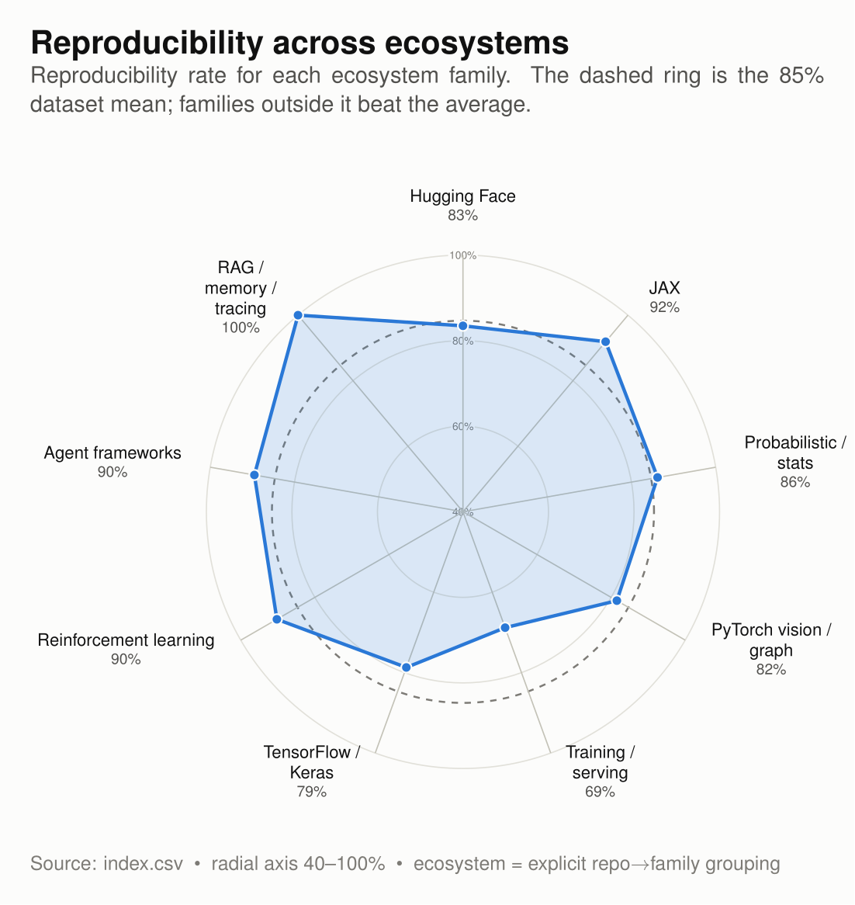
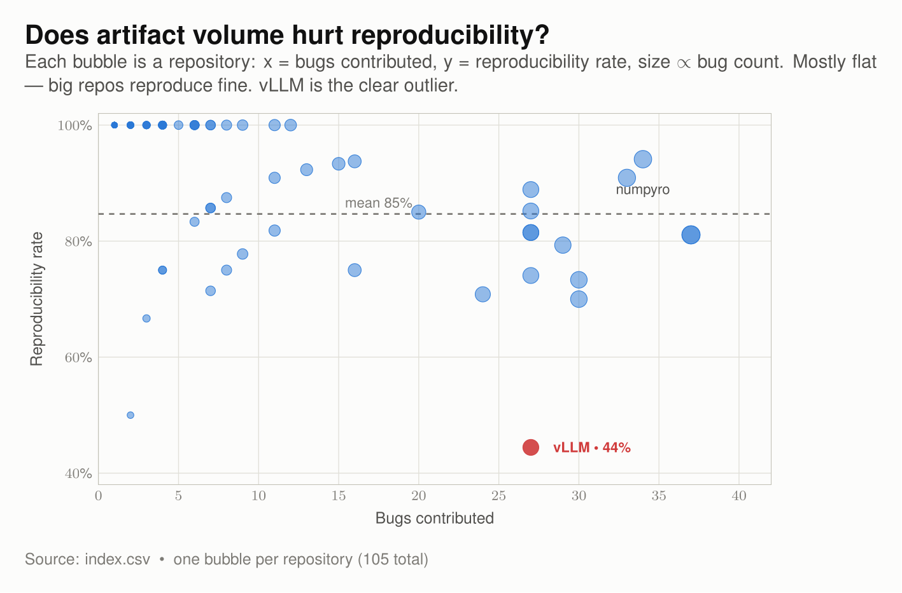
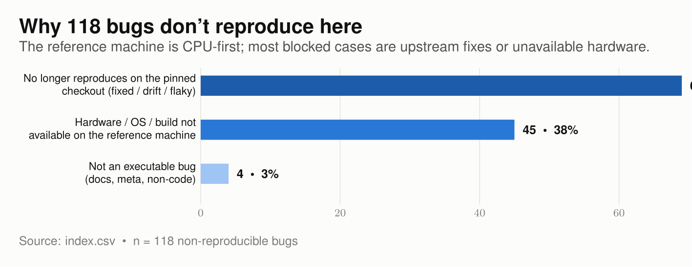

# AIFaultBench: A Reproducible Benchmark of Real-World Deep-Learning and Agentic AI Bugs

> **📢 MSR 2027 Mining Challenge Proposal.** A reproducibility benchmark of real-world
> AI/ML bugs — from classical ML through deep learning to LLM agent frameworks —
> packaged as self-contained, runnable reproductions.

[](TODO)
[](https://doi.org/10.5281/zenodo.21422606)
[](https://huggingface.co/datasets/mehilshah/MSR-MiningChallenge-2027)
[](https://doi.org/10.5281/zenodo.21422606)

A reproducibility benchmark of **770 real-world AI/ML bugs** mined from the issue trackers of
**105 popular repositories** across **76 organizations** — transformers, JAX, vLLM, DeepSpeed,
diffusers, PyTorch Lightning, TorchRL, PyG, detectron2, NumPyro, SDV, and, on the agentic side,
LangChain, LangGraph, LlamaIndex, smolagents, DSPy, CrewAI, AutoGen, pydantic-ai, and more.

Every bug is packaged as a **self-contained, runnable reproduction**: a minimal script that
triggers the bug, the exact dependencies to install, a script that recreates the buggy codebase
at the offending commit, and a **reproduction trajectory** documenting how the bug was
reproduced and what was observed. Of the 770 bugs, **652 are verified reproducible** on the
reference machine; the remaining 118 ship with a reason they could not be reproduced (hardware
access, pinned builds, or upstream fixes) — 116 of them individually documented.

| Bugs | Reproducible | Not reproducible | Repositories | Organizations | Domains | Package size |
|:----:|:------------:|:----------------:|:------------:|:-------------:|:-------:|:------------:|
| **770** | **652** (85%) | **118** (15%) | **105** | **76** | **6** | ~61 MB on disk<br>(~16 MB compressed) |

Every bug carries a `domain` label. The six domains and their reproduction rates:

| Domain | What it covers | Bugs | Repos | Reproducible |
|--------|----------------|:----:|:-----:|:------------:|
| `DL`      | deep-learning frameworks, model implementations, vision/graph libraries | 307 | 50 | 256 (83%) |
| `LLM`     | foundation-model training, tuning, and serving                          | 151 | 12 | 114 (75%) |
| `Agentic` | agent frameworks, orchestration, tool calling, memory, tracing           | 130 | 18 | 119 (92%) |
| `ML`      | probabilistic / statistical modelling, black-box optimization           | 118 | 10 | 102 (86%) |
| `RL`      | reinforcement learning                                                  |  40 |  3 |  37 (92%) |
| `Tooling` | MLOps, packaging, notebooks, developer infrastructure                   |  24 | 12 |  24 (100%) |

The repository → domain mapping is explicit and re-runnable in
[`scripts/assign_domain.py`](scripts/assign_domain.py).

**New here?** [`consume_dataset.ipynb`](consume_dataset.ipynb) is a runnable tour of the package:
load the index, inspect one bug end-to-end from shipped evidence, filter by domain, and build an
agent task packet. Every required cell uses only the Python standard library — `pandas` and
`matplotlib` appear in two clearly-marked optional cells that skip cleanly if absent. It executes
top to bottom in well under a second and never touches the network.

*(Figures for all of the below are collected in [§7 Figures at a glance](#7-figures-at-a-glance).)*

> Codebases and Python environments are **regenerated on demand** (clone + checkout + venv), not
> shipped — which is why the whole package is ~61 MB on disk (~16 MB compressed) rather than tens
> of gigabytes.

---

## Contents

1. [Key findings](#1-key-findings)
2. [What's in the package](#2-whats-in-the-package)
3. [Reproducing a single bug](#3-reproducing-a-single-bug)
4. [Running experiments across the benchmark](#4-running-experiments-across-the-benchmark)
5. [How the benchmark was built](#5-how-the-benchmark-was-built)
6. [Data notes & known limitations](#6-data-notes--known-limitations)
7. [Figures at a glance](#7-figures-at-a-glance)
8. [Citation & license](#8-citation--license)

---

## 1. Key findings

**The dataset is broad and reproducible.** 652 of 770 bugs (85%) reproduce out of the box on a
single reference machine, spanning 105 repositories and 76 organizations. The Hugging Face
modelling stack alone (transformers, diffusers, accelerate, peft, …) contributes 146 bugs; the
Pyro/NumPyro probabilistic-programming ecosystem 63; the agent-framework ecosystem (LangChain /
LangGraph, LlamaIndex, smolagents, DSPy, CrewAI, AutoGen, …) 130; and the PyTorch, JAX,
TensorFlow/Keras, vLLM, and DeepSpeed families round out the rest.

**Reproducibility is gated by hardware, and the gate is concentrated in distributed / GPU-serving
libraries.** Reproduction rates are high and tight across most repositories (70–94% for repos with
≥ 15 bugs), but **vLLM sits far below the pack at 44%** — and most of its non-reproducible bugs
fail on GPU/accelerator environment issues: broken or incompatible CUDA builds, missing or
mismatched accelerators (Hopper/H100), or multi-GPU topologies the single reference machine cannot
provide. At the other end, **NumPyro (94%) and smolagents (94%)** sit highest: largely CPU-friendly
probabilistic code and agent-orchestration logic with few hardware dependencies. In other words,
*what a library is for* predicts how reproducible its bugs are on commodity hardware.

**Agentic bugs are the most reproducible domain, for a structural reason.** The `Agentic` domain
reproduces at 92% — well above `DL` (83%) and `LLM` (75%). Agent-framework faults concentrate in
orchestration, serialization, schema/tool-call handling, and state management, which run on CPU
and can be triggered against recorded payloads without a provider client, credential, or network
call. Faults in `LLM` serving and training stacks, by contrast, are frequently gated on the exact
accelerator. This makes the agentic split unusually attractive as an evaluation set: nearly all of
it is executable on commodity hardware.

**When a bug doesn't reproduce, we say why.** 116 of the 118 non-reproducible cases carry a
`blocking_reason` (see [§6](#6-data-notes--known-limitations) for the two exceptions). Grouping
them:

| Category | Count | What it means |
|----------|:-----:|---------------|
| No longer reproduces on the pinned checkout | **69** (58%) | The standardized checkout no longer exhibits the reported behavior — fixed upstream, version drift, misdiagnosis in the original report, or nondeterministic/flaky. |
| Hardware / OS / build not available | **45** (38%) | Needs a GPU, multiple GPUs, ROCm/MPS, a specific OS, or a pinned build/dataset absent from the reference machine. |
| Not an executable bug | **4** (3%) | Documentation-only, a repo-tagging request, an unsupported-endpoint mismatch, or otherwise non-code. |

The takeaway for tool builders: the 652 reproducible bugs give you a clean pass/fail oracle,
while the 118 non-reproducible cases are a *labeled* study set for environment sensitivity — most
are gated by hardware you can add, or by upstream fixes you can pin around.

> The 69 / 45 / 4 split is a coarse manual grouping of the free-text `blocking_reason` fields
> (61 / 43 / 3 over the original deep-learning bugs, plus 8 / 2 / 1 from the agentic split); the
> exact line between "fixed upstream" and "differs on this host" is judgment-dependent for a
> handful of cases. It is *not* computed from the index — it is hardcoded in
> [`scripts/make_figures.py`](scripts/make_figures.py), which asserts that it still sums to the
> number of non-reproducible rows in `index.csv`. The precise per-bug reason is always in
> `index.csv` and each `reproduction.json`.

---

## 2. What's in the package

**All 770 bugs — deep-learning and agentic alike — live in one flat `bugs/` tree**, under a single
index. There is no separate split directory; `domain` is a column, not a folder.

```
.
├── README.md                     # this file
├── consume_dataset.ipynb         # runnable tutorial: load, inspect, filter, evaluate
├── assets/                       # figures used in this README
├── scripts/                      # figure generation + the domain mapping
├── index.json                    # ← START HERE: canonical bug_id → report/commit/status map
├── index.csv                     # flat mining-metadata view of the same 770 bugs
└── bugs/                         # one folder per bug: 001 … 774 (zero-padded, 770 total)
    └── <bug_id>/
```

> Bug ids run `001`–`774` with a few gaps (770 folders). Ids `645`–`774` are the agentic split;
> they were merged in from a separate `agentic_bugs/` directory and their ids were preserved, so
> **the id range is stable across releases** — filter on `domain`, not on the numeric id.

### The two index files

They cover the same 770 bugs but carry **different columns**, and neither is a superset:

- **`index.json` is canonical for reproduction.** It is the only file with `commit`, `clone_url`,
  `bug_report`, `codebase_present`, `blocking_reason`, `setup_command`, and `run_command`, plus a
  nested `github` object (labels, reactions, resolution time, fix commit). Booleans are native
  JSON booleans.
- **`index.csv` is the flat mining view.** It is the only file with `issue_state`, `author`,
  `n_labels`, `labels`, `n_comments`, `has_fix`, `linked_pr_numbers`, and `enrich_error`. Every
  value is a **string**, and booleans serialize Python-style as `True` / `False` — compare
  explicitly, never for truthiness.

Fields shared by both:

| column | meaning |
|--------|---------|
| `bug_id`      | folder name, zero-padded (e.g. `001`) — always a 3-character string |
| `library`     | free-text mining label (see [§6](#6-data-notes--known-limitations); prefer `repository`) |
| `repository`  | GitHub `owner/repo` — the recommended grouping key |
| `domain`      | `DL`, `LLM`, `Agentic`, `ML`, `RL`, or `Tooling` |
| `issue_url`   | the original bug report on GitHub |
| `reproducible`| whether the bug was verified to reproduce on the reference machine |

`index.json` additionally carries the reproduction contract:

| field | meaning |
|-------|---------|
| `commit`           | commit hash to check out for reproduction |
| `clone_url`        | git URL of the repository |
| `bug_report`       | path to the local bug-report text (e.g. `bugs/001/bug_report.txt`) |
| `codebase_present` | `true` if a codebase snapshot ships in-folder (rare); otherwise clone it |
| `blocking_reason`  | if not reproducible, why (empty otherwise) |
| `setup_command`    | commands to recreate codebase + environment |
| `run_command`      | command that triggers the bug |
| `github`           | nested issue metadata: labels, comments, reactions, resolution time, best-guess fix commit |

### Each `<bug_id>/` folder

| file | purpose |
|------|---------|
| `bug_report.txt`            | the GitHub issue (title, date, URL, description, repro steps) |
| `repro.py`                  | minimal script that triggers the bug |
| `requirements.txt`          | bug-specific Python dependencies |
| `setup_codebase.sh`         | `git clone` + `git checkout <commit>` — recreates the codebase |
| `setup_env.sh`              | creates a local `.venv` and installs `requirements.txt` |
| `run_repro.sh`              | runs `setup_env.sh`, then `repro.py`, capturing stdout/stderr |
| `reproduction.json`         | structured record: `reproducible`, `steps`, `evidence`, `blocking_reason`, `reproduction_command` |
| `reproduction_trajectory.md`| human-readable narrative — **how the bug was reproduced** and what was observed |
| `repro_stdout.log` / `repro_stderr.log` | captured output from the reproduction run (evidence) |
| `README.md`, `manifest.json`| per-bug notes and metadata |

Some folders additionally carry a small helper module, config file, or vendored `codebase/`
where a plain clone was not sufficient — these are the only non-regenerable inputs and are kept
deliberately.

---

## 3. Reproducing a single bug

Reproduction uses a local Python **virtualenv** — no Docker required. Pick a bug id from
`index.json`, then:

```bash
cd bugs/001

# 1. Recreate the codebase at the buggy commit (not shipped with the dataset)
bash setup_codebase.sh

# 2. Build the environment and run the reproduction
bash run_repro.sh            # creates .venv, installs deps, runs repro.py

# 3. Inspect what happened
cat reproduction_trajectory.md   # the steps taken + expected observation
cat repro_stdout.log repro_stderr.log
```

A reproducible bug fails (raises the reported error, produces the wrong result, etc.) exactly as
described in `bug_report.txt`. The expected signal, the exact steps, and the evidence are
documented in `reproduction_trajectory.md` and, in structured form, in `reproduction.json`
(`steps`, `evidence`, `reproducible`, `blocking_reason`, `reproduction_command`).

> **Python versions.** Bugs pin their own dependency sets and may need a specific interpreter
> (e.g. `python3.10`); `setup_env.sh` selects it. Install the required interpreter if it is not
> already on `PATH`.
>
> **GPU bugs.** Some bugs require a GPU (or multiple GPUs); their `blocking_reason` notes the
> hardware requirement. As [§1](#1-key-findings) shows, most of the 118 non-reproducible cases
> are hardware- or platform-gated, or fixed upstream.
>
> **Agentic bugs need no API keys.** All 119 reproducible bugs in the `Agentic` domain trigger
> offline against recorded payloads, mock transports, or local stubs — no provider credential and
> no outbound call beyond the initial `git clone` and `pip install`. Verified by static scan: none
> reads a credential from the environment without first supplying a dummy value, and none issues an
> unstubbed HTTP request or opens a network socket.

Bug `645` is a good agentic starting point (`langchain-ai/langchain`, offline, CPU-only):

```bash
cd bugs/645 && bash setup_codebase.sh && bash run_repro.sh
```

---

## 4. Running experiments across the benchmark

The benchmark is designed for evaluating automated tools — bug reproducers, program-repair / APR
systems, agents, fault localizers. Typical loop:

```bash
#!/usr/bin/env bash
set -euo pipefail

python3 - <<'PY' | while IFS= read -r bug_id; do
import json
# index.json stores native booleans; index.csv stores the STRINGS "True"/"False".
for b in json.load(open("index.json")):
    if b["reproducible"]:                     # add: and b["domain"] == "Agentic"
        print(b["bug_id"])
PY
  ( cd "bugs/$bug_id" || exit 0
    bash setup_codebase.sh
    # --- invoke YOUR tool here, e.g. feed it bug_report.txt + codebase/ ---
    # your_tool --bug-report bug_report.txt --codebase codebase --repro repro.py
    bash run_repro.sh || true          # confirm the bug still triggers pre-fix
  )
done
```

Filtering the index programmatically:

```python
import json, collections
bugs = json.load(open("index.json"))

reproducible = [b for b in bugs if b["reproducible"]]              # 652
agentic      = [b for b in bugs if b["domain"] == "Agentic"]       # 130
agentic_ok   = [b for b in agentic if b["reproducible"]]           # 119
transformers = [b for b in bugs if b["repository"] == "huggingface/transformers"]

by_domain = collections.Counter(b["domain"] for b in bugs)
by_repo = collections.defaultdict(list)
for b in bugs:
    by_repo[b["repository"]].append(b["bug_id"])   # group by repository, not library
```

The same filters on `index.csv` need explicit string comparison — every value there is a string,
and booleans are Python-cased:

```python
import csv
rows = list(csv.DictReader(open("index.csv")))
reproducible = [r for r in rows if r["reproducible"] == "True"]     # NOT "true", NOT truthiness
```

**Recommendations**

- Run each bug in its own fresh virtualenv — dependency sets across bugs conflict by design
  (different library versions, CUDA builds, Python versions). `setup_env.sh` already isolates each
  bug in its own `.venv/`.
- Parallelize per-bug, but pin CPU/GPU resources; several bugs are memory- or GPU-hungry.
- For repair/agent evaluation, treat `run_repro.sh` exit + `reproduction.json` as the oracle: the
  bug is *fixed* when the reproduction no longer produces the reported signal.
- Start from the 652 `reproducible` bugs for clean pass/fail evaluation; the 118 others are useful
  for studying environment sensitivity and are labeled with why.
- Group by the `repository` column, not `library` — see [§6](#6-data-notes--known-limitations).
- Stratify by `domain` when reporting results. The domains differ sharply in reproduction rate
  (`Tooling` 100% → `LLM` 75%) and in what a fix even means, so a single aggregate number hides
  most of the signal.
- **For a CPU-only evaluation, the 119 reproducible `Agentic` bugs are the cheapest entry point** —
  no GPU, no API keys, no network beyond clone + install.

---

## 5. How the benchmark was built

Issues were mined from the target repositories' trackers and standardized into the per-bug folder
layout above. For each bug a minimal reproduction bundle (`repro.py`, `requirements.txt`,
`setup_env.sh`) was written, then the reproduction was executed in an isolated virtualenv and its
outcome recorded in `reproduction.json` and narrated in `reproduction_trajectory.md`.
`index.json` / `index.csv` summarize every bug (issue link, commit, reproduction status) for setup
and evaluation.

The 130 `Agentic` bugs were mined later, in a second pass over 18 agent-framework repositories,
and were originally packaged in a separate `agentic_bugs/` directory. They are now **merged into
the same `bugs/` tree under the same index and the same ten-file per-bug contract**; the only
thing that distinguishes them is the `domain` column. Their bug ids (`645`–`774`) were preserved
through the merge, so ids remain stable across releases.

The `domain` label itself comes from an explicit repository → domain mapping in
[`scripts/assign_domain.py`](scripts/assign_domain.py). Run it to verify the per-domain counts
against the paper's Table 1:

```bash
python3 scripts/assign_domain.py           # report only, writes nothing
python3 scripts/assign_domain.py --write   # re-emit the `domain` column into both indexes
```

---

## 6. Data notes & known limitations

- **Group by `repository`, not `library`.** The `library` field is a free-text label carried over
  from mining and is not fully normalized: it contains casing duplicates (`SDV`/`sdv`,
  `DeepSpeed`/`deepspeed`) and, in two rows, a full `owner/repo` string pasted into the column
  (`pytorch/examples`, `tensorflow/models`). It resolves to 122 distinct labels for the same
  **105 repositories**. For any grouping or
  per-project analysis, use the clean `repository` column.
- **Reproduction is single-machine.** "Reproducible" means *reproduced on the reference machine*.
  A bug marked not reproducible is not necessarily fixed — 38% of those cases simply need
  hardware (multi-GPU, ROCm/MPS, specific accelerators) or an OS/build the reference host didn't
  have. Check each `blocking_reason` before drawing conclusions.
- **Two blocked bugs carry no reason.** `bugs/157` (huggingface/transformers) and `bugs/541`
  (pyg-team/pytorch_geometric) are marked `reproducible: false` with an empty `blocking_reason`
  in both `index.json` and their own `reproduction.json`. They are counted in the 118 and in the
  grouping above, but their individual reason was not recorded. Exclude them if your analysis
  depends on the reason text.
- **Reproduction depth varies; some scripts mirror the fault rather than executing it.** 44 of the
  652 reproducible scripts re-implement the buggy logic locally instead of driving the subject
  library, and **13 of those never import the library or touch `codebase/` at all**. For those 13,
  a fix to the upstream project cannot change the reproduction's outcome, so **they are not valid
  repair targets** — they document the fault rather than gate on it. The per-bug record for 40 of
  them (bug id, repository, path, and whether the script touches the subject library) ships in
  [`scripts/mirror_style_repros.json`](scripts/mirror_style_repros.json); the remaining four —
  `bugs/046`, `bugs/347`, `bugs/354`, `bugs/589` — carry the same disclosure as an inline comment
  in `repro.py` instead. A further ~29 scripts
  assert over source constants rather than runtime behavior. Roughly 410 of the 652 clearly
  exercise the library at runtime; the rest sit between these poles. **Filter against that file
  before using the benchmark as an APR oracle.**
- **Seven "reproducible" entries are not AI faults.** `bugs/036`, `bugs/136`, `bugs/169`,
  `bugs/172`, `bugs/187`, `bugs/551`, and `bugs/774` reproduce a documentation, packaging, or link
  defect rather than a fault in an AI system. They are kept in the package for completeness;
  exclude them from per-domain fault characterization.
- **Only 84 bugs (11%) carry a fix commit**, in `github.fix.best_guess_fix_commit` in
  `index.json`; `linked_pr_numbers` in `index.csv` is empty for all 770. The benchmark's oracle is
  the reproduction, not a reference patch — do not treat it as a paired buggy/fixed corpus.
- **Captured logs record reference-machine paths.** `repro_stdout.log` / `repro_stderr.log` are
  verbatim evidence from the original run and were deliberately left unedited. Paths inside them
  therefore reflect the machine and directory layout at capture time — including, for ids
  `645`–`774`, the pre-merge `agentic_bugs/` directory name. This is expected; the files are
  evidence, not configuration.
- **Upstream state drifts.** Codebases are recreated from public repos at pinned commits; if an
  upstream repository is deleted or force-pushed, `setup_codebase.sh` for the affected bugs may
  need adjustment.

---

## 7. Figures at a glance

All figures are generated from `index.csv` by [`scripts/make_figures.py`](scripts/make_figures.py)
(LaTeX / TikZ + pgfplots, rasterized with `pdftocairo`) so the numbers always match the shipped
data. Re-render them with `python3 scripts/make_figures.py` (needs a TeX distribution with
pgfplots, plus `pdftocairo` from poppler). The one exception is the blocking-reason grouping,
which is a manual classification hardcoded in that script — see the note in
[§1](#1-key-findings).

**Reproduction status.** 652 of 770 bugs (85%) reproduce on the reference machine.

<p align="center"></p>

**Bugs per repository.** The 15 largest contributors, each split into reproducible vs. not.

<p align="center"></p>

**Reproduction rate by repository.** Share of each repo's bugs that reproduce (repos with ≥ 15
bugs); vLLM is the clear low outlier, NumPyro and smolagents the highest.

<p align="center"></p>

**Reliability ranking by ecosystem.** Reproducibility rate per ecosystem family (an explicit
repo→family grouping, including the two agentic families); dots below the 85% mean under-perform.

<p align="center"></p>

**Reproducibility across ecosystems.** The same ecosystem rates as a radar; families outside the
dashed mean ring beat the average.

<p align="center"></p>

**Does volume hurt reproducibility?** Each bubble is a repository (x = bug count, y = rate, size ∝
count). The relationship is essentially flat — big repos reproduce fine; vLLM is the outlier.

<p align="center"></p>

**Why the 118 don't reproduce.** Nearly all blocked cases are upstream fixes / drift or
unavailable hardware — not the bug genuinely disappearing.

<p align="center"></p>

---

## 8. Citation & license

<!-- TODO: replace with the real citation/DOI once available -->
If you use this benchmark, please cite the accompanying paper:

```bibtex
@misc{AIFaultBench_2027,
  title  = {AIFaultBench: A Reproducible Benchmark of Real-World Deep-Learning and Agentic AI Bugs},
  author = {Shah, Mehil B and Rahman, Mohammad Masudur and Khomh, Foutse},
  year   = {2027},
  note   = {MSR 2027 Mining Challenge dataset},
  doi    = {10.5281/zenodo.21422606}
}
```

Each bug's original report and source code remain under the license of its upstream repository
(`repository` / `clone_url` in `index.json`); the packaging, reproduction scripts, and metadata in
this dataset are released under the license stated on the dataset record.
